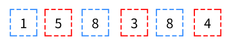

[剑指 Offer 62. 圆圈中最后剩下的数字](https://leetcode-cn.com/problems/yuan-quan-zhong-zui-hou-sheng-xia-de-shu-zi-lcof/)

> 0,1,,n-1这n个数字排成一个圆圈，从数字0开始，每次从这个圆圈里删除第m个数字。求出这个圆圈里剩下的最后一个数字。
>
> 例如，0、1、2、3、4这5个数字组成一个圆圈，从数字0开始每次删除第3个数字，则删除的前4个数字依次是2、0、4、1，因此最后剩下的数字是3。

这其实是约瑟夫环问题，只是把圆圈代表人，删除代表枪毙，剩下代表活着。

每枪毙一个人，后面的人就往前排上继续数，直至最后一人。

你可以用java的ArrayList来模拟操作得到答案，但是这不够有趣：）

思考一下，**最后活着的人是不是留在第一个位置？**那可不可以**反推**枪毙最后一人时，**活着的人的位置？**一共有n个人，就反推$n-1$次，就能找到最后活着的人最开始的位置了。

关键在于，怎么通过“最后活着的人在第一个位置”推出每轮枪毙时“他的位置”。

第m个是要枪毙的人。如果超出n个人，则需要用m%n来确定枪毙谁。

假设活下来的人，每轮的位置为x。那么**前一轮，他的位置是不是离被枪毙的人为x个**（因为枪毙后会重新数数）？可以用m+x​来表示。如果超出n个人，需要用（m+x）%n来确定活着的人的位置。

而x的起始值为0，自然可以推出两个人时，三个人时，乃至n个人时的x为多少。

[319. 灯泡开关](https://leetcode-cn.com/problems/bulb-switcher/)

> 初始时有 n 个灯泡关闭。
>
> 第 1 轮，你打开所有的灯泡。 第 2 轮，每两个灯泡你关闭一次。 第 3 轮，每三个灯泡切换一次开关（如果关闭则开启，如果开启则关闭）。
>
> 第 i 轮，每 i 个灯泡切换一次开关。 对于第 n 轮，你只切换最后一个灯泡的开关。
>
> 找出 n 轮后有多少个亮着的灯泡。
>
> 

题目意思很简单，n个灯泡，切换n轮，每轮切换间隔为当前轮数。

你可以用java的...但是这不够有趣：）。

1. 一个灯泡在最后是否亮着取决于在这个灯泡的**切换次数是否为奇数**。

2. 一个灯泡**切换的次数是根据它所在位置的因数个数**（重复只算一次）决定。例如：
   $$
   6=1×6、2×3
   $$
   一共切换4次。所以6会在第一轮，第二轮，第三轮，第六轮被切换。

3. 若一个灯泡所在的位置**刚好为完全平方数**，例如：
   $$
   4=1×4、2×2
   $$
   一共切换3次。而完全平方数**必有因数重复**，导致切换次数为奇数。所以灯泡位置为完全平方数时，这个灯泡最后是亮着的。

4. 至此问题可以转换为1~n中有多少个完全平方数，即答案为根号n[^1]

[1503. 所有蚂蚁掉下来前的最后一刻](https://leetcode-cn.com/problems/last-moment-before-all-ants-fall-out-of-a-plank/)

> 有一块木板，长度为 n 个 单位 。一些蚂蚁在木板上移动，每只蚂蚁都以 每秒一个单位 的速度移动。其中，一部分蚂蚁向 左 移动，其他蚂蚁向 右 移动。
>
> 当两只向 不同 方向移动的蚂蚁在某个点相遇时，它们会同时改变移动方向并继续移动。假设更改方向不会花费任何额外时间。
>
> 而当蚂蚁在某一时刻 t 到达木板的一端时，它立即从木板上掉下来。
>
> 给你一个整数 n 和两个整数数组 left 以及 right 。两个数组分别标识向左或者向右移动的蚂蚁在 t = 0 时的位置。请你返回最后一只蚂蚁从木板上掉下来的时刻。

题目大致意思是，一群蚂蚁在木板上爬，有的向右爬有的向左爬，碰头了就转方向，求木板上最后一只蚂蚁掉落时是什么时候。

你...太麻烦了，也不够有趣：）

可以换个思路，因为题目说“更改方向不会花费任何额外时间”，所以可以把**“同时改变移动方向”**看做**“一只蚂蚁穿过另一只蚂蚁继续走”**。不影响结果的同时，计算量也从每时每刻计算蚂蚁位置，变成了一只蚂蚁朝一个方向爬要多久从木板上掉下。只要对比每只蚂蚁的时间，取最大值就是答案了。

[877. 石子游戏](https://leetcode-cn.com/problems/stone-game/)

> 亚历克斯和李用几堆石子在做游戏。偶数堆石子排成一行，每堆都有正整数颗石子 piles[i] 。
>
> 游戏以谁手中的石子最多来决出胜负。石子的总数是奇数，所以没有平局。
>
> 亚历克斯和李轮流进行，亚历克斯先开始。 每回合，玩家从行的开始或结束处取走整堆石头。 这种情况一直持续到没有更多的石子堆为止，此时手中石子最多的玩家获胜。
>
> 假设亚历克斯和李都发挥出最佳水平，当亚历克斯赢得比赛时返回 true ，当李赢得比赛时返回 false 。

...好像不能用动态数组简单粗暴的模拟，只能用深搜或是动态规划来求出是否能赢，也不够有趣：）

你可以将这一行石子按照奇偶数来分成两行

例如：$158384$

你发现奇数个的数值相加比偶数个的数字相加来的大，所以你可以直接拿左边的1，剩下的5和4都是偶数列。

每轮你都跟着他的方向拿，不管他挑哪一个，你就把**露出来的奇数列拿走，留给他的局面只有偶数列**。

反过来也是一样，偶数列数值相加大就拿偶数列

所以先手必赢。

[^1]: 若是求100到200内有多少个完全平方数，可知$10²=100$，$14²+4=200$，所以有$14-10+1=5$个平方数。而1到n可以理解为$√n-1+1=√n$

以上题目与部分图片均转载自[leetcode](https://leetcode-cn.com/)