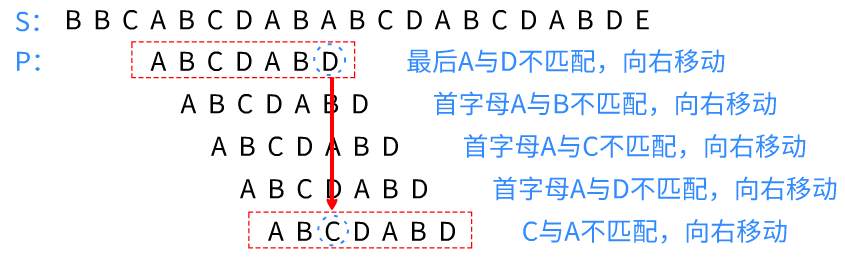
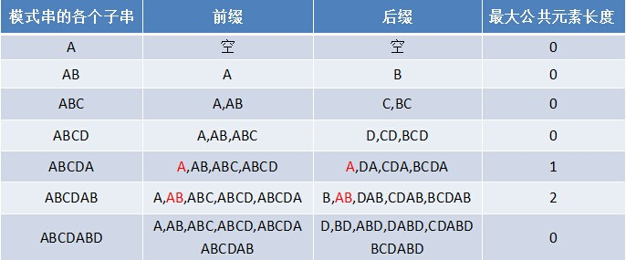
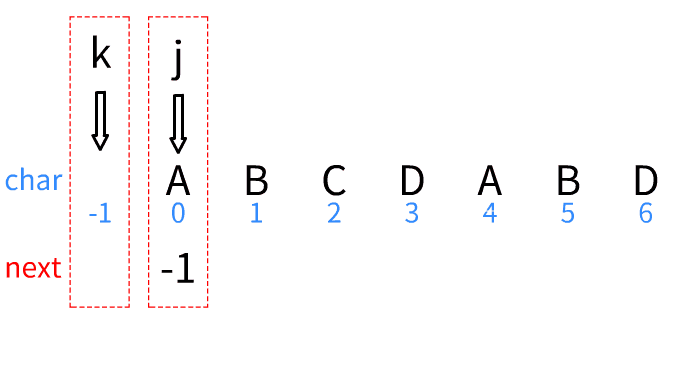

##### 什么是KMP？

kmp是一种字符匹配算法，可以用来比较一串字符（父串S）中是否包含另一串字符（子串P）。

接下来讲一下大体思路，后面细说。

比起暴力匹配，kmp**借助子串自有的信息来规避必定错误的匹配**，实现优化。

那kmp是怎么做到匹配错误时，**避免从头开始，而是直接跳到x位置**呢？

你会发现，在**“起跳”**位置D，与**“落地”**位置C，前面都有个AB。

而ABC属于子串P的一个前缀[^1]，ABD属于子串P的一个后缀。这两个缀唯一不同的地方在最后一个字母D和C。

当D与父串S不匹配时，就会跳到和它相同前缀的ABC，让C与父串S比较。也正是因为他们**有相同的前缀**，跳转才不会失败。

例如“ABCDABD”的“最长公共前后缀表”为

[-1，0，0，0，0，1，2]（后续解释）

而D是最后一个值2，当字符不匹配时就跳转到2（第三个位置）重新匹配

##### 什么是最长公共前后缀？

> 若是给你一个字符串，你会用什么方法得到这个字符串的最长公共前后缀呢？

你会很自然的从头开始一一对比，就像子串与父串比较那样

例如“ABCDABD”:

- 将A与B比较，发现不同
- C,D同理，直到再次匹配到A（下标4），
- 拿起B（下标1）与匹配到的第二个位置（下标5）比较，发现B与B相同，
- 拿起C（下标2）与匹配到的第三个位置（下标6）比较，发现C和D不同，放弃匹配。
- 将A与剩下的BD比较，发现都不同

但是这个方法比较慢，慢在最后一步**“将A与剩下的BD比较”**

突破口在刚刚那张图里的“各个子串”。

从“A”到“AB”是怎么计算公共前后缀的？或者换个问法

> 若是你知道了“ABCDAB”的最长公共后缀，你可以知道“ABCDABD”的吗？

具体操作如下：

- 两个指针（k，j）放在字符数组$char[]（“ABCDABD”）$上
- 创建一个next数组，用来存放以$j-1$为结尾的字符串有多长公共前后缀。
- 令$next[0]=-1$

只有三步：

1. k=-1时，$jk$同时移动，$next[j]=k$
2. 字符相等，$jk$同时移动，$next[j]=k$
3. 字符不相等时，根据$next[k]$移动k

一点一点解释:

对于字符串“ABCDABD”，用来存放**以j为结尾的字符串有多长公共前后缀**的数组应该为[0，0，0，0，1，2，0]（从最开始图中的最大公共元素长度中可以得知），那它是怎么变成[-1，0，0，0，0，1，2]的呢

1. **全部往右移动一格：**
（1）计算出的next数组是需要当作**“参考跳转表”**的。若是不移动，当位置匹配到D而不适配时，就需要从前一个位置B那里，才能拿到“相同前缀”的地方。
   （2）与其说是右移动，不如说是**用“-1”的代价**，导致后续匹配时被“强行-1”。而这个“代价”刚好成为了（1）的优势

2. **将next[0]设为-1：**前缀的第一个值设为-1，这样在比较时才**可以清楚的知道“当前匹配的字符为第一个”**。若是**“连第一个都匹配不上”**，则会对k进行**“暂时的流放”**，等待j移动到下一个位置，k又会重新回归，对新的字符进行比较。而这个过程与第二步“字符相等”时操作一样，所以可以把步骤1，2合并起来。

   

回到刚刚说的“突破口”

为什么k能够利用$next[k]$来进行跳跃呢，看起来很反常不是吗，这玩意儿能自己用自己，在动画快结束的时候愣是能往回跳两下。

因为**k用的都是“j曾经走过的路”**，是之前“慢慢累积起来”的数据。从一个字符到两个，从两个到三个，j利用k不断拓宽边界，k也在利用“j的遗产”来指导j。而“最后跳两下”也是k在尽力帮j，在**满足前缀相同的条件下获得更大的数字**，而跳到-1时，就相当于k在对j说：“兄弟，你以前留下的东西只允许我帮你到这了，删档玩下个号吧”。

回到最开始，$jk$什么也没有，是你给了他们一个起始值“-1”，而它们就能根据你定的规则，用自己已有的数据向后探索——是不是有动态规划（跳转）的味儿？

继续回到kmp

现在你一手拿着子串P，一手拿着next数组，准备开始干父串S，但是心中还有疑问：为什么我拿着一个“最长前后缀表”就可以跳的不出错了？为什么是子串的后缀跳前缀，如果有相同的“中缀”，不能跳到“中缀”吗？

第一个问题：在跳之前，是不是得要先“匹配出错”，那**出错之前呢**？出错之前是不是**已经有些字符匹配了，才能轮到这个字符“不匹配”**？而在那些“已匹配”的字符中，**本身就包含着子串P的字符**。所以根据“匹配出错”的前一个位置的后缀，跳转到相同的前缀就不会出错。

第二个问题：举个例子：“ABABCABD”，为什么后缀ABD只能跳到前缀ABA，而不是中缀ABC？

因为**最终是要和父串S比的**，若是你能保证后缀与前缀相同，那么跳过去不会错；但若是你跳到中缀，就相当于**拿着“前缀+中缀”去比较后缀**。如果例子是“ABABAB”，那确实可以从“后缀AB（4，5）”跳到“中缀AB（2，3）”，那是因为**中缀AB本身就包含在了“前缀ABAB”和后缀“ABAB”里了**。

kmp的具体流程其实和填充next数组相似：

创建两个指针$i，j$，分别指向父串S与子串P。当对比字符不相等时，就用$next[j]$来对$j$进行跳跃重新匹配。若是字符相等或是$j$根据$next[j]$变成-1了，那$i$和$j$同时向前移动重新匹配。

这个过程是不是很熟悉呢，**$i$和$j$分别充当了刚刚填充next数组里的$j$和$k$**。

若是想参考具体代码，可前往[leetcode28.实现strStr()](https://leetcode-cn.com/problems/implement-strstr/solution/)的题解区

[^1]: 前缀是从头往后数，后缀是从后往前数，但是相互比较时，比较顺序是一个方向。
