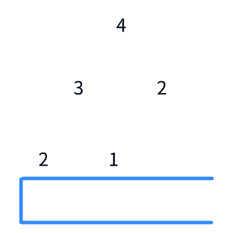
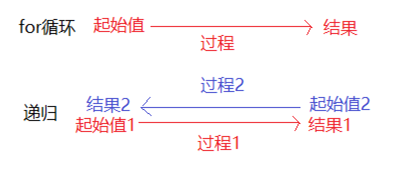
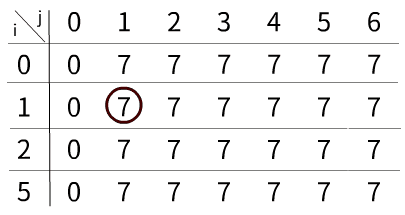

**动态规划本质上是针对特殊问题的一种遍历**

还记得广度优先搜索的那幅动画吗

红色方框代表了一个阶段，只有这个阶段内所有路口的“岔路”被压入队列时，阶段才会向下移动。这里的路口其实是一个**状态**，岔路是一种**选择**。只有当这个阶段中所有的状态所拥有的选择被纳入**“问题储藏室”**后，这个阶段才可以移动，不然可能会遗漏答案。

还记的递归和深度优先搜索那幅动画吗

虽然没有“阶段”之说，但是当你选了一个状态中的选择时，就要把这个状态，以及这个状态的其他选择纳入**“问题储藏室”**，留给后续解决。

而动态规划是从最小的问题出发，每当解决一个状态时，这个**解决后的结果会被纳入“答案存储室”**，等到后续碰到大问题，就从这个储存室里拿一些答案组装成大问题的答案。而这个大问题的答案也会被纳入这个存储室，做为更大问题答案的原材料。

- 深搜是抓住一个问题使劲薅，薅秃了再换下一个。
- 广搜是把所有问题并在一起，一截一截的解决。
- 动规是从小问题开始解决，通过小问题拼成大问题。

深搜和广搜是**先自顶向下的分配问题**，通过你定义的规则**将问题以栈和队列的方式保存**，也通过你定义的初始值，逐一解决栈和队列里的问题，最终拼凑成答案。

动规是**自底向上的解决问题**，通过你定义的初始值与规则，也**通过数组的方式将答案保存**，使问题规模不断扩大，最终**触碰**到题目的答案。

之所以大费笔墨的写很多“看似与动规无关”的东西，是想让你知道动态规划并不是一个被“孤立”出来的算法，而是和其他算法一样，**是为了遍历所有情况而采取的一种形式**。

而动规这种形式也有很多“弱点”：

- 既然动规的解决方法是通过旧问题的答案拼出新问题的答案，那如果**没有旧问题呢**？比如广搜中的打开转锁盘，我扭一次就是个新数字，每一个都是新问题。动规最大的优势就是**减少重复计算**，都是新问题怎么减少。这就是没有**重叠子问题**。

- 动规是用数组来保存旧问题的答案，也就是说只有**数字才能保存进答案，下标用来当做状态**。而对于数字而言，数值大小是很重要的一个指标，所以大部分动规问题都是**求最值**。既然动规**只能保存一个状态的一个答案**，那如果后续我需要**一个答案之前的所有状态**怎么办？比如深搜中的N皇后，我每下一个棋子，都要考虑以前的棋子会不会影响到我这次的落子。也就是“当前状态的答案需要以前的所有状态”——过去能影响到未来，这是**有后效性**，动规无法解决。

  

- 还记得递归中的这幅图吗。深搜是自顶向下，借助着数学归纳法所得出的递推公式先铺路，等拿到了起始值2就走原先的路回去。而动态规划是自底向上的，它可没有先铺的路可走，它需要**从下到上的递推公式**。而动规的递推公式也叫做**状态转移方程**——从过去解决过的小问题中，挑出符合的状态，拿他们的答案，转移到大问题这个状态中，得到大问题的答案。找到这个方程或许是动规最难的点。

- 动规是借助状态转移方程求得的大问题的答案，而这个大问题的答案往往是一个最值。问题来了，**如果不能保证小问题的答案是这个小问题的最优解，那推出来大问题的答案也不能代表是整体最优的。**所以如果要使用动规的话，还得满足**最优子结构**——一个状态下存在最优解。

小结：动规使用*状态转移方程*，不断利用过往已解决的子问题来解决大问题。而为了确保大问题答案的准确无误，子问题必须满足*最优子结构*。因为动规是利用数组保存一个状态下的最优解，所以当一个问题具*有后效性*时，动规并不适用。而如果在一个问题里有很多*重复子问题*，若是能用动规则会大大节约时间。

先拿道题目感受一下动规

[322. 零钱兑换](https://leetcode-cn.com/problems/coin-change/)

> 给定不同面额的硬币 coins 和一个总金额 amount。编写一个函数来计算可以凑成总金额所需的最少的硬币个数。如果没有任何一种硬币组合能组成总金额，返回 -1。
>
> 你可以认为每种硬币的数量是无限的。

解法：

题目中有**两个变量**，一个为“不同面额的硬币”，一个为“总金额”，目的是求“凑成总金额最少需要多少硬币”。

**将硬币与金额用于控制状态**，$dp[i][j]$表示**在包括$i$面值的硬币下，凑成$j$金额最少需要多少硬币**。

如果当前金额无法使用$i$面值的硬币，就拿在相同金额下，不使用该种硬币时答案，来当做此答案。

$$
dp[i][j]=dp[i - 1][j]
$$
如果当前金额可以使用$i$面值的硬币，则拿金额减去该面值时的最少硬币加一，与不拿时做比较，选少的一方作为该状态的答案[^1]。

$$
dp[i][j] = Math.min(dp[i][j - coins[i-1]] + 1,dp[i-1][j])
$$
设置初始值。当金额为0时，无需硬币也能凑成，当$j=0$时填充0。当第一个面值大于金额时是无法选取的，所以需要额外填充一行作为补充。由于是比较最小值，所以补充的值要尽量大，选取$amount+1$填充[^2]。若是最后的答案为$amount+1$，就返回-$1$代表没有答案。

当硬币为1、2、5，总金额为6时的动画

你可以**将一行看做是一个阶段**，一个阶段中是以金额从小到大的顺序将状态排列，而一个面值就是一个阶段。你可以多看几遍动画，感受一下这种**利用过往答案，不断往外扩展的计算方式**

本题中，一个状态始终受到上个阶段同个位置的影响。

如果面值大于金额，无法使用该面值的硬币，就只能拿上个阶段（即在没有这个面值下）同个位置的值做答案。如果可以使用该面值的硬币[^3]，就把同个阶段$j-coins[i-1]$的金额的值拿过来比较。相当于在比较“我拿这个硬币好，还是不拿这个硬币好”。这个**拿不拿**，就是一种**选择**，你可以通过比较，**选择一个最优解当做该状态的答案**。而可供你选择的原材料，正是你以前解决过的小问题，源头来自你设置的初始值。

再仔细观察，**一个状态只受上一个阶段的同位置状态，以及同个阶段的某个状态影响**，它不会跟抽疯一样，突然拿前面某某个阶段的某某个状态。所以完全可以把二维数组降到一维数组，反正前面解决过的问题的答案都保留在原地，直接拿来用就好——这就是**状态压缩**。

所以，怎么设计一个动规呢？

动规的解法是不断拼凑小问题成大问题，既然如此，题目所给出的有关变量也必须是**可分割**的。你可以根据**变量个数划分出不同维度的数组**，像是刚刚的题目就可以先用金额和面值分成一个二维数组，而**$dp$的值往往是题目所要求的的答案**。这时候你可以在纸上画出表格，**填充一下初始值**，例如“金额为0时不用凑，所以值为0”之类的。填充完后问问自己剩余的状态应该怎么填，若是**选择**这个状态，该怎么**凑**出最优解，**不选择**又该怎么**凑**。这个选和凑就是写出状态转移方程的关键。

拿道简单题试试手

[198. 打家劫舍](https://leetcode-cn.com/problems/house-robber/)

> 你是一个专业的小偷，计划偷窃沿街的房屋。每间房内都藏有一定的现金，影响你偷窃的唯一制约因素就是相邻的房屋装有相互连通的防盗系统，如果两间相邻的房屋在同一晚上被小偷闯入，系统会自动报警。
>
> 给定一个代表每个房屋存放金额的非负整数数组，计算你 不触动警报装置的情况下 ，一夜之内能够偷窃到的最高金额。

只涉及到房屋金额**一个变量**，所以用个一维数组**$dp[i]$表示在包括第$i$间房屋时，能偷到的最高金额。**

$dp[0]$代表在当前只有第一个房屋时的状态，只有它能偷，所以将1号房屋金额填充进$dp[0]$。$dp[1]$代表包括第二个房屋时的状态，你可以对比一号房屋，哪个数值大哪个填充进$dp[1]$。

那么$dp[3]dp[4]...dp[n]$应该怎么填充呢？

关键在我要不要偷（选）这$i$号房

如果我**不偷**，可以把$i-1$个屋子偷到的金额算在$i$个屋子上$ dp[i] =dp[i - 1]$。

如果我**偷**，为了不触动报警装置， 只能把$i-2$个屋子偷到的金额拿来与$i$个屋子相加$dp[i] = dp[i - 2] + nums[i]$。把这两个金额作比较，哪个金额高哪个算在$i$个屋子上，所以状态转移方程为：
$$
dp[i] = Math.max(dp[i-1],dp[i - 2] + nums[i])
$$
因为一个答案所需要的状态始终为$dp[i - 1]与 dp[i - 2] $，所以可以使用两个变量保存，不断交替算出答案。

每个阶段都对应着“包括多少间屋子”，也就是一个阶段只有“比上个阶段多个屋子”这一个状态。而零钱兑换里，每个“面值”阶段，都有对应“金额”个的状态数量。

[1143. 最长公共子序列](https://leetcode-cn.com/problems/longest-common-subsequence/)

> 给定两个字符串 text1 和 text2，返回这两个字符串的最长公共子序列的长度。
>
> 一个字符串的 子序列 是指这样一个新的字符串：它是由原字符串在不改变字符的相对顺序的情况下删除某些字符（也可以不删除任何字符）后组成的新字符串。
> 例如，"ace" 是 "abcde" 的子序列，但 "aec" 不是 "abcde" 的子序列。两个字符串的「公共子序列」是这两个字符串所共同拥有的子序列。
>
> 若这两个字符串没有公共子序列，则返回 0。

两个字符串是两个变量，所以用个二维数组**$dp[i][j]$表示在“包括前$i$个text1字符”与“包括前$j$个text2字符”下，有多长的公共子序列。**

当text1或text2包括的字符为0时，公共子序列长度为0

那么$dp[i][j]$怎么填充呢？

关键在我**选不选这个字符作为公共子序列的一员**

我能不能选还有个先决条件，这text1的$i$字符和text2的$j$字符得要一样我才有选择的资格。

若是**不同**，$dp[i][j] = Math.max(dp[i - 1][j] , dp[i][j - 1])$。$dp[i-1][j]$代表了上个阶段（还没这个字符时）同个位置的状态。而$dp[i][j-1]$代表了同个阶段的上一个状态，把它放入比较是因为**我们并不能确定在之前的状态中，是否已经把这个字符纳入公共子序列的一员**，所以需要比较，哪个大留下哪个。

若是**相同**，$dp[i][j] = dp[i-1][j - 1]+1$。为什么**直接等于**呢？原因在于，同个阶段下的之前状态，你不能确定这个字符是否已被纳入过，毕竟选过一次就不能再选了。而上个阶段的所有状态不包含这个字符，**加上这个字符一定比不加长**。$dp[i-1][j - 1]$代表了上个阶段相同位置的前一个位置，这样取**避免了text2的第$j$个字符被重复选择。**

这道题不太好优化空间，主要是涉及到了$dp[i-1][j - 1]$，不能直接覆盖掉以前的答案。要优化只能优化成两行数组，还麻烦，所以保持原样。

归纳一下如何设计动规：

- 按变量个数创建不同维度的数组，确定状态

- 根据状态与答案所提出的要求确定dp值

- 填充底层数据，确定初始值

- 利用状态的“选与不选”推出状态转移方程

- 判断是否可以优化空间

说了半天，什么时候使用动规呢？

是题目说**求最值**的时候用，还是题目**有重复子问题**的时候用？

其实是要看这个题目本身，**在转移状态时用的是什么方式**

- 每个阶段只有一个状态，像打家劫舍那样，那它其实是递推，只不过是借动规优化出来的。

- 每个阶段有多个状态，一个阶段的最优解只利用上个阶段的最优解，用的是贪心算法。

- 每个阶段有多个状态，一个阶段的最优解要通过以前所有阶段的所有状态得到，用的是搜索。

- 每个阶段有多个状态，一个阶段的最优解可以利用之前某个阶段的某个状态得到，才用动规。

参考：

https://www.zhihu.com/question/23995189/answer/35429905

[^1]: $dp[i][j - coins[i-1]]$中的$coins[i-1]$选取的就是$i$面值的硬币，因为需要填充初始值，占了一行，所以需要减一来选取面值。
[^2]: 因为最小面值硬币为1，最大也大不过$amount+1$
[^3]: 注意蓝框的位置，都是在可用时出现

以上题目均转载自[leetcode](https://leetcode-cn.com/)
