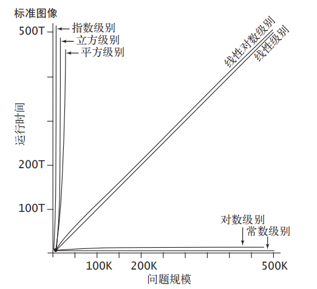
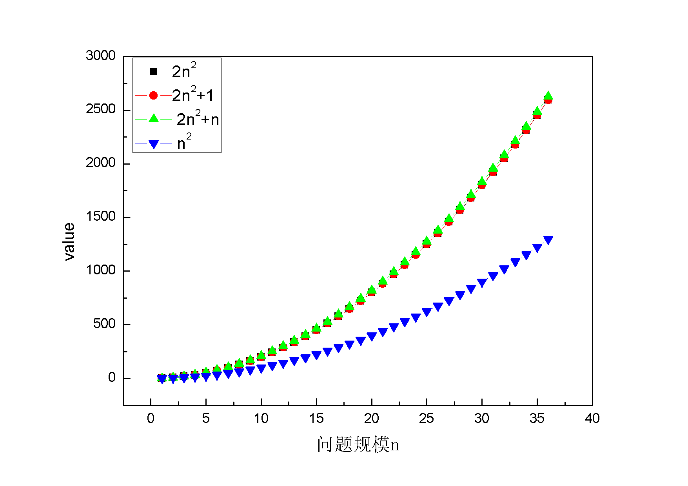
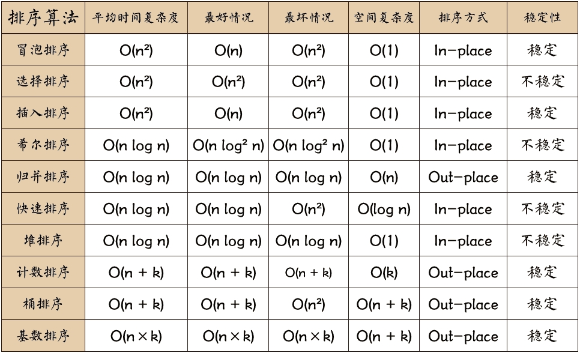

##### 为什么需要算法复杂度？

假设现在有两种算法可以解决同一个问题，你应该选择哪一种？

算法复杂度是为了衡量算法优劣所设立的一种标准，你可以依靠这套标准来选择与改进。

##### 什么是算法复杂度？

算法复杂度是指算法在编写成可执行程序后，运行时所需要的资源，资源包括时间资源和内存资源。

简单来说，算法优劣有两个指标可以参考：

- 时间复杂度：用来预估执行程序的时间长短

- 空间复杂度：用来预估占用内存的空间大小

##### 怎么计算算法复杂度？

###### 时间复杂度：

> 一个程序运行的总体时间≈执行每条语句的耗时*执行语句频率

- 每条语句的耗时：取决于计算机，编译器和操作系统。

- 执行语句的频率：取决于你写的算法和输入的规模

由于前者在大部分情况下都无法改变（或者已经给定），所以我们只讨论后者（执行频率）对于程序运行时间的影响。

举例：

1. *遍历一个长度为n的数组*

   ”遍历“就是一种算法，”长度为n“就是**输入的规模**。

   遍历一次数组，**执行频率就为n**，遍历两次为2n

2. *在一个长度为n且已排序的数组中用二分法找到一个数*

   > 假设这个数组是【1,2,3,4,5,6,7】，要找的数字为7。那么二分法就是先找到这个数组的中位数4,7比4大，所以把在4右边的数字拎出来【5,6,7】。再找这个数组的中位数6，7比6大，只剩下一个数组7,。再把7与7比较，相等，所以找到了数字7。

   “二分法”就是一种算法，“长度为n”就是**输入的规模**

   很明显二分法这种“对半分”的搜索方式会比“遍历”来的更为快捷，因为减少了搜索次数。

   用二分法查找一次数组**执行频率为logn**（底数为2的对数，通常省略2）

3. *对一个长度为n的数组使用冒泡法排序*

   > 冒泡排序大题的思路是“比较相邻数”。假设一个数组是【7,6,5,4,3,2,1】，对他进行升序排序。从第一个开始，7和6比，7比6大，于是7和6交换位置。7和5比，7比5大，7和5交换位置。。。第一次将7排完之后数组变成了【6,5,4,3,2,1,7】，第二次将6排完之后数组变成了【5,4,3,2,1,6,7】以此类推最终将排序完成。

   “冒泡排序”就是一种算法，“长度为n”就是**输入的规模**

   进行一次冒泡排序相当于在遍历中嵌套遍历（粗略），所以**执行频率为n²**。

4. *对一个长度为n的数组求子集*

   “求子集”就是一种算法，“长度为n”就是**输入的规模**

   求一次子集所**执行的频率为2^n**。

常见的增长数量级函数中，输入规模与时间的关系

但是在现实中有很多因素需要我们考虑，可能是在每次遍历时需要打印一段字，或者记录一下遍历次数，甚至是要将两个算法融合在一起。每次都要将这些时间考虑进去是非常耗费时间的（例如n³+n²+n+1...），并且也不是每次都可以准确的计算出执行频率。

于是人们开始用**执行频率的增长数量级**来表示时间复杂度。

而随着输入规模的扩大，**低阶项所带来执行频率的提升远没有最高阶项所带来的高**

从图中的四个函数可以看出，只要是**相同阶数的最高阶**，差别并不是很大。而n²与其他函数的差异是可以容忍的[^1]，所以可以将 “2n²”，“2n²+1”，“2n²+n”的执行频率的增长率都化为“n²”（只留最高阶项，忽略最高阶项常数以及其他项）。

于是可以用一类符号来代表只考虑最高阶项的数，可以简单理解为：

- O（增长率上限）
- Ω（增长率下限）
- Θ（增长率相等）

一般情况下我们都是用“大O”符号来表示时间复杂度[^2]。

> T(n)=O(f(n))

- T(n)：时间复杂度

- f（n）：执行语句的频率

- O（）：一种可以简化f（n）的符号，代表f（n）增长率的上限

通常我们可以直接说一个算法的时间复杂度为O（），下图为十种常见排序的时间/空间复杂度

###### 空间复杂度:

由于空间复杂度会根据题目产生多种情况，并且对于我们新手来说并不常用，本文仅为了解。

> S(n)=O(f(n))	

可以直接用输入的规模进行比对：如果输入的为一维数组，空间复杂度就为O（n），二维数组为O（n²）

[^1]: 当我们取函数 2N² +cN 的近似为～ 2N² 时，我们的假设是 c 很小。如果事实c很大（比如 c 可能是 10三次方 或是10的六次方 ），该近似就是错误的
[^2]: 《算法第四版》：它简化了对增长数量级的上限的研究，甚至也适用于一些无法进行精确分析的复杂算法。另外，它还可以和计算理论中用于将算法按照它们在最坏情况下的性能分类的“大 Omega”和“大Theta”符号一起使用。如果存在常数 c 和 *N*0 使得对于 *N*>*N*0 都有｜ *f*(*N*) ｜ > c*g*(*N*)，则我们称 *f*(*N*) 为 *Ω*(*g*(*N*))。如果 *f*(*N*) 既是 *O*(*g*(*N*)) 也是 *Ω*(*g*(*N*))，则我们称 *f*(*N*) 为 Θ(*g*(*N*))。“大 Omega”记法通常用来表示最坏情况下的性能下限，而“大 Theta”记法则通常用于描述算法的最优性能，即不存在有更好的最坏情况下的渐进增长数量级的算法。

以上图片均转载自网络，侵删