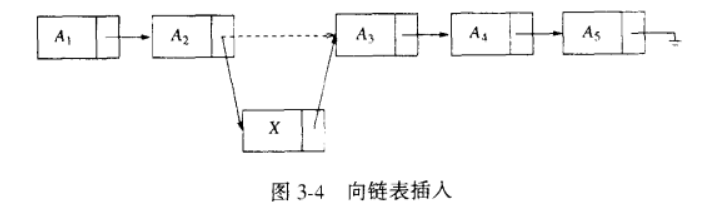

##### 为什么需要数组和链表？

因为数据需要按照特定规律存储在计算机中，便于人们使用，而数组和链表是两种最基本的数据结构。

##### 什么是数组和链表？

- 数组：在计算机内存中划分出一块区域，将数据按顺序排放
- 链表：存放一个数据的同时保存下一个数据在内存中的地址，通过地址找到下一个数据

想象一张画满格子的白纸，用数组来存放数据意味着要按照顺序填充。例如划分第一行和第二行的格子空间给数组，数组只能连续的把数据一个一个填充进格子。

而链表可以在白纸上“随心所欲”的填写数据，不用理会顺序。但是在一个格子里不单要有数据，还要有下一个格子的“坐标”，这样才能把一条链表完整的读取出来。

链表相当于一列火车，每一个数值相当于一个车厢，每一个存放下一个数据的地址相当于火车厢用于连接的铰链，将所有数据一对一的链接在一起。在计算机中，你可以把这个地址指向看做是不限制长度且有方向的铰链。

链表分为单向链表和双向链表，数组分为一维数组，二维数组和多维数组。

双向链表就是从火车尾逆着向上再加一条铰链。

二维数组是以数组为元素的数组，即**数组的数组**，多维数组以此类推。

##### 为什么是两种基础的数据结构而不是其中的一种？

举个例子：

> 假设一个数组是[1,2,3,4,5,6,7]，现在你需要在其中的任意位置插入一个数字。

由于数组是连续排放的，**插入一个位置需要后面的所有数字往后挪一位**。例如在1前插入数字，就需要把整个数组的数字往后one by one 的挪，非常消耗时间，而链表的出现解决了这个问题。

链表插入一个数字，只需要令A2指向X，X再指向A3即可

而删除A3的数据只需要将A2指向A4即可，这样在遍历的时候就直接**跳过**了A3

链表的增加和删除操作（O(1)）比数组（O(n)）快的多，但是为什么还需要数组呢？

因为数组的查询（O(1)）比链表的查询（O(n)）快

我如果想知道一个位置的数据是什么，对于数组来说是非常简单的。因为数组是连续排放，计算机可以通过[寻址公式](https://www.jianshu.com/p/a0338256610b)快速定位。但如果是链表，你就必须要抓着火车头，顺着铰链从头到尾的捋一遍，效率就没有数组来的快，而且这个铰链可是要占空间的。

所以数组和链表都有存在的必要，需要根据不同场合选择合适的数据结构。而队列、栈、树、图之类的数据结构就是人们通过对数组和链表一步一步抽象封装起来的，底层还是依靠这两种数据结构。

以上图片均转载自《数据结构与算法分析-C语言描述》

