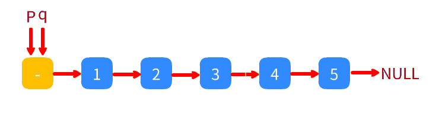
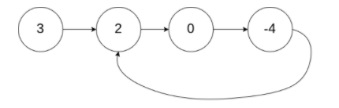
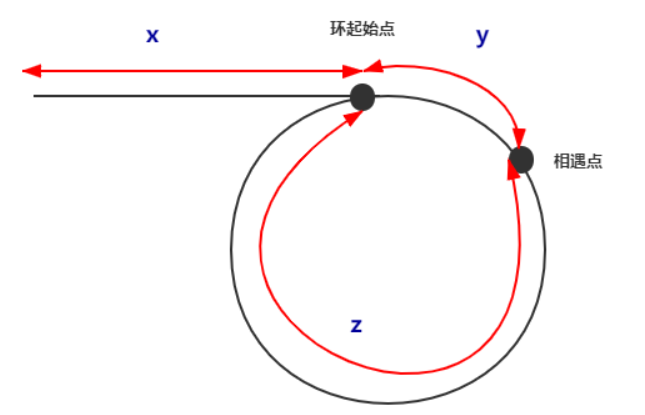
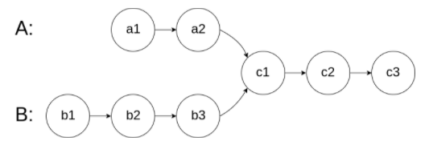
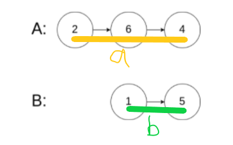
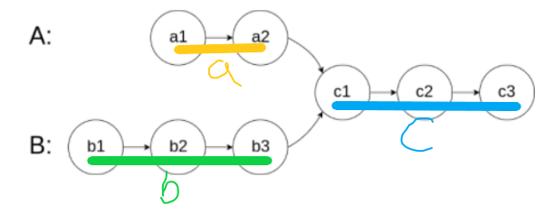

如果要介绍关于链表和数组的算法题，双指针技巧是一定要先了解的

##### 什么是双指针技巧？

双指针技巧并不是一种具体的算法，而是一种思路，用一道题目能够很好地理解双指针的概念。

> 删除链表的倒数第N个节点

可以看到最开始有两个指针p和q同时指着一个空的链表头（虚拟节点），程序运行时，先让q往前走N个位置停住，之后p和q按照一步的频率同时往前移动，当指针q走到链表末尾时，删除p连接的“后车厢”，接上“新车厢”完成题目。

双指针技巧大体有两类，分为快慢指针和左右指针。

- 快慢指针：两个指针同时朝一个方向移动，一个在前一个在后
- 左右指针：一个指针在头，一个指针在尾，同时向中间移动

而一种叫做滑动窗口的技巧就是由双指针技巧所演化而来。

##### 怎么使用双指针技巧？

接下来列举一些关于链表的常见算法题

[141.环形链表](https://leetcode-cn.com/problems/linked-list-cycle/)

> 给定一个链表，判断链表中是否有环。

有时候链表的铰链会连接到前面的车厢，当你想要遍历这个链表的时候就会死循环。

解法：在链表头创建两个指针A和B，让**A以两步的频率**往前移动，**B以一步的频率**往前移动，如果这个链表中存在环，那么一定有**某个时刻A和B会在圈里相遇**。如果没有环，A最终会指向空指针遍历完毕。

你可以简单理解为A跑得快B跑得慢，如果有环，A只能在里面转圈和B碰面，没环A就能跑完。

[142.环形链表2](https://leetcode-cn.com/problems/linked-list-cycle-ii/)

> 给定一个链表，返回链表开始入环的第一个节点。 如果链表无环，则返回 `null`。

如果这个链表有环，是否能求出环的起点？

解法的前部分和刚刚一样：创建两个指针，慢指针以一步的频率向前移动，快指针的频率为两步，最终他们会在圈内相遇。

相遇之后**将其中一个指针移动到链表头，再让他们同时以一步的频率往前移动**，他们就会在环的起始点相遇，返回指针位置完成题目。

x，y，z如图所示，假设两指针相遇时，当前快指针走的路程为S1，慢指针走的路程为S2，有：

$$
S1=x+y+z+y
$$

$$
S2=x+y
$$

其中S1中的z可以比图中画的路程**多整数倍环的路程**，由于多走的是整圈，所以并不影响位置。

因为快指针比慢指针走的频率快一倍，路程也多一倍

$$
S1=2S2=2x+2y
$$

$$
S1=x+y+z+y=2x+2y
$$

$$
x=z
$$

意味着从链表头到环起始点的距离等于相遇点到环起始点的距离（加上整数倍环的路程）

所以当一个指针在相遇点，另一个在起点，并且以一步为频率同时向前移动时，就会在环起始点相遇。

[160.相交链表](https://leetcode-cn.com/problems/intersection-of-two-linked-lists/)

> 编写一个程序，找到两个单链表相交的起始节点。

如果有两个链表串在了一起应该如何判断？

解法是：

1. 创建两个指针x，y，分别在A，B的头部

2. 都以**一步的频率**同时向前移动。

3. 如果其中一个指针遍历完一条链表，就马上**跳转到另一个链表的头部**进行遍历

   （例如x遍历完链表A，马上从头去遍历链表B，另一个也是如此）。

4. 两个指针在遍历过程中相遇，则两个链表相交，没有相遇则链表没有相交。

先来看没有相交的情况

假设指针x在这两次遍历的总路程为S1，y为S2

$$
S1=a+b
$$

$$
S2=b+a
$$

当两条链表有相交时，两个指针所走过的路程：

$$
S1=a+c+b+c
$$

$$
S2=b+c+a+c
$$

可以看到当指针x走了$a+c+b$时，指针y刚也好走了$b+c+a$，和指针x一样**停在了两个链表的相交处**。所以两个指针如果相遇，两个链表就有相交。

以上题目与部分图片均转载自[leetcode](https://leetcode-cn.com/)

