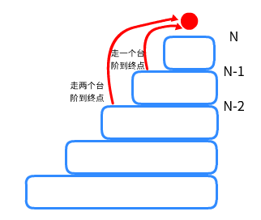

##### 为什么需要递归？

因为需要更加复杂的遍历。

我们可以利用递归这一手段，定义更多的规则来满足我们的遍历。

##### 什么是递归？

想象一下你面前是深不见底的走廊，顺着走廊的右手边都是关上门的房间。你只知道答案在第一个房间里，但是发现第一扇门上贴着“钥匙在第二个房间”的纸条。你来到第二扇门，发现也贴着“钥匙在第三个房间”的纸条...以此类推，你终于来到了第100个房间的门前，发现这扇门开着。之后从第100个房间里取出第99个房间的钥匙，打开第99个房间拿到第98个房间的钥匙...最终你拿着99把钥匙站在第一扇门前，打开了第一扇门找到了答案。

“走路”其实是**自我调用**，从1走到100为**递**，从100回到1为**归**，"发现第100扇门开着"是你设置的**初始值**。

举个例子：

[509. 斐波那契数](https://leetcode-cn.com/problems/fibonacci-number/)

> 有一个数列为fib：[1，1，2，3，5，8...]从第三个数（下标为2）开始，每个数都是前两个数的和。

所以第n个数为 $fib（n）=fib（n-1）+fib（n-2）$，现在要你求第n个数

递归方法代码：

```java
public static int fib(int N) {
    if (N == 1 || N == 2) {
        return 1;
    }
    return fib(N - 1) + fib(N - 2);
}
```

这一块代码的方法名字叫做 fib()，在`return fib(N - 1) + fib(N - 2);`那调用了两次方法，并且将结果相加。

比如我想求第四位，传入参数4

1. 因为N=4不为1或2，所以调用$fib(3) + fib(2)$，按顺序先解决$fib(3)$
2. 因为N=3不为1或2，所以调用$fib(2) + fib(1)$，按顺序先解决$fib(2)$
3. 因为N=2的值为1，所以返回1
4. 接着第二步的第二个问题$fib(1)$，因为$N=1$的值为1，所以返回1
5. 接着第一步的第一个问题$fib(3)$，因为$fib(2) + fib(1)=2$，所以返回2
6. 接着第一步的第二个问题$fib(2)$，因为$N=2$的值为1，所以返回1
7. 将第一步的答案合并，解出$fib(4)=fib(3) + fib(2)=2+1=3$


其中用栈来记录**还未被解决的问题**：

> 栈相当于一个网球桶，先扔进去的被上面压着，每次取都只能取最上一个，即先入后出

1. 想解决fib(4)，但是要知道fib(3)和fib(2)，按顺序先解决fib(3)，于是把fib(4)、fib(2)压入栈。
2. 想解决fib(3)又需要fib(2)、fib(1)，按顺序先解决fib(2)，于是把fib(3)、fib(1)压入栈。
3. 之后由于你有设置n=1或2时等于1的答案，所以下面的问题就会从栈顶逐一弹出后再逐一解决。

这种压入栈的方式其实像在**铺路**。

想一想for循环是怎么遍历一个数组的：给一个起始值，给一个数组长度，给一个步长（每一步走多长，通常为1）。只要有这三个数你就可以遍历一个数组。

而递归**用自我调用的方式**，按照你定义的规则**将问题以栈的形式排列。**你只要给个起始值2（n=1或2时结果为1），就能像for循环一样得到问题的最终解。


过程1在铺路，铺到你给的起始值2的位置**（递）**，之后拿着起始值2顺着过程1的反方向即过程2走**（归）**，最终得到结果2。

可以看到动画里红线就是压入栈的过程，相当于在每个交叉路口留一步，到底之后按蓝线往回走，只要一看到之前有在岔路留下标记，便又会重新向下递归。

##### 怎么设计递归：

书中有许多关于递归的设计法则[^1]。

但其中有一个递归非常重要的核心——**数学归纳法**。它保证了在不同参数下所面对的情况一致（除了起始值或特殊值），只有数学归纳法才能保证你铺的路到底是不是对的，否则有一个特殊情况都无法得到正确结果。

无论你是**自底向上**，从最小的测试集中寻找能不断推进的方法；还是**自顶向下**，将往下的结果打包成一个黑盒调用，寻找普遍规律——本质上都是在寻求数学归纳法中的**递推公式**，只不过它的方向是**从上到下的**。

当你找到了递推公式，你自然就知道了应该怎样设置起始值，怎样写才能让它不断推进，怎样避免重复计算。至于怎么找，请再看我刚写的话。

举个例子：

[70. 爬楼梯](https://leetcode-cn.com/problems/climbing-stairs/)

> 假设你正在爬楼梯。需要 *n* 阶你才能到达楼顶。
>
> 每次你可以爬 1 或 2 个台阶。你有多少种不同的方法可以爬到楼顶呢？

- 如果只有一个台阶，只需要一步。两个台阶，有两种走法，一种是走两步1个台阶，一种直接走2个台阶。三个台阶怎么走？要么从第一个台阶一步走到，要么从第二个台阶走一步。
- 如果是第$n$个台阶应该怎么走呢



递推公式为：
$$
f(n)=f(n-1)+f(n-2)
$$
你会发现这个递推公式和斐波那契数列是一样的，不同点在于起始值。斐波那契数列的起始值为 $n=1或n=2$时返回1，而爬楼梯的起始值为$n=1$返回1，$n=2$返回2。

这两道题的递归注重于对结果2的返回，而递归还有一点是注重过程2中的操作

[面试题 08.06. 汉诺塔问题](https://leetcode-cn.com/problems/hanota-lcci/)

> 在经典汉诺塔问题中，有 3 根柱子及 N 个不同大小的穿孔圆盘，盘子可以滑入任意一根柱子。一开始，所有盘子自上而下按升序依次套在第一根柱子上(即每一个盘子只能放在更大的盘子上面)。移动圆盘时受到以下限制:
> (1) 每次只能移动一个盘子;
> (2) 盘子只能从柱子顶端滑出移到下一根柱子;
> (3) 盘子只能叠在比它大的盘子上。
>
> 请编写程序，用栈将所有盘子从第一根柱子移到最后一根柱子。

将三根柱子依次命名为ABC

- 如果只有一个盘子，直接将盘子从A移动到C。如果有两个盘子，将小盘子先放到B，把大盘子放到C，再把小盘子移到C解决。


- 如果盘子大于两个以上，为n个盘子呢。将n-1个小盘子移动到B，把大盘子放到C，再把n-1个小盘子移到C解决。


- 你问怎么把 n-1个小盘子移动到B？再想想你是怎么把n个盘子从A移动到C的，你就知道怎么把n-1个盘子从A移动到B的


你可以想象，如果需要将n个盘子从A移动到C，那么你的**主轴**为A，**目标轴**为C，**辅助轴**为B（即从A到C需要B的辅助）。而递归的下一层仅仅是把B和C的轴**交换位置**，即可完成辅助轴与目标轴的切换。当程序不断递归到最后一层，即$n=1$时将盘子从A放到C。这时的A和C只是一个用来接收上次递归接收进来的参数的位置，而并非A和C本身。之后不断返回，通过**路程2**来打印盘子移动的顺序。


这篇文章主要是为了介绍递归是什么。如果你按照文中的方法解斐波那契数列以及走楼梯，会因为超时而导致过不了测试集，接下来我提出一些优化方案。

你可以在斐波那契数列的递归图中看出，程序会不断的访问同一个已经求过的值。如果我们能够拿一个数组，把每一个已经求过的值存储起来，每当我再次要求这个数时，先去数组看看之前有没有存，如果有直接拿来用就行。这可以叫做**记忆化**，也算是**剪枝**的一种，用来避免重复计算。

你还会发现，既然你已经有了起始值2，也有了递推公式$f(n)=f(n-1)+f(n-2)$，目的是为了求结果2，可以不走路程1，而是只走路程2吗？这是可以的，因为斐波那契数列和走楼梯这两道题目符合最优子结构，你大可以将递推公式倒个方向：$f(n-1)+f(n-2)=f(n)$当作路程2，拿着起始值2用for循环不断求出结果2，这便是动态规划最简单的形式。


参考：

汉诺塔：https://www.cnblogs.com/dmego/p/5965835.html


[^1]: 《数据结构与算法分析C语言描述》：1.基准情形。你必须总要有某些基准的情形，它们不用递归也能求解。2.不断推进。对于那些需要递归求解的情形，递归调用必须中能够朝着产生基准情形的方向推进。《算法》第四版：1.递归总有一个最简单的情况——方法的第一条语句总是一个包含 return 的条件语句。2.递归调用总是去尝试解决一个规模更小的子问题，这样递归才能收敛到最简单的情况。3.递归调用的父问题和尝试解决的子问题之间不应该有交集。

以上题目与部分图片均转载自[leetcode](https://leetcode-cn.com/)与网络

