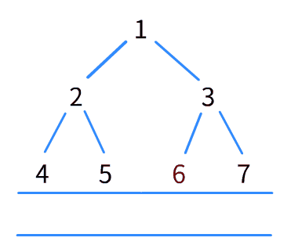

##### 什么是队列与栈？

队列与栈是用来描述**对数据的不同操作**

栈是**限制插入和删除只能在一个位置上**进行的表，该位置是表的末端，叫做栈的**顶**。对栈的基本操作有push（进栈）和pop（出栈），前者相当于插入，后者则是对最后插入的元素删除。

像栈一样，队列（queue）也是表。然而，使用队列时**插入在一端进行**，而**删除则在另一端进行**。

关于队列和栈的算法题就不得不提广度优先搜索和深度优先搜索这两个算法，在此先讨论关于队列的广搜，下一篇笔记介绍深搜。

##### 什么是广度优先搜索（BFS）？

> 如何知道通过一个迷宫的最短路径是哪条路？

以广度优先搜索的办法来举例：当你遇到一个路口时，就根据对应的岔口数来“分身”，让多个自己能够同时走迷宫。就这样，每遇到一个路口你的“分身”都再分一次身，直到其中一个分身走到终点结束。

- 入口1压入队列
- 将队列头1弹出，压入1的2，3两个岔口，
- 将队列头2弹出，压入2的4，5两个岔口，
- 将队列头3弹出，压入3的6，7两个岔口...

当队列头弹出的数字为终点时结束。

红色的方框可以当做一种**阶段**，只有当**这个阶段内所有路口的“岔路”都被压入队列**时，阶段才会往下移动

> 你可以理解为：水面上的波纹，层层推进。

先来道简单题试试“水”

[111. 二叉树的最小深度](https://leetcode-cn.com/problems/minimum-depth-of-binary-tree/)

> 给定一个二叉树，找出其最小深度。
>
> 最小深度是从根节点到最近叶子节点的最短路径上的节点数量。
>
> 说明：叶子节点是指没有子节点的节点。

1. 创建一个队列，把根（3）压入，并用**一个变量记录深度**
2. 把队列中的数字弹出，并将该数的子节点一一压入队列（3弹出，9，20压入）。**变量加一**
3. 直至其中一个弹出的数字符合题目要求，（没有左节点也没有右节点，例如9就没有左和右节点），结束循环，返回变量

- 步骤一就像在平静水面上制作涟漪的初始水滴（根节点和变量）
- 步骤二是不断往外扩散的波纹（总是一圈一圈的，不会有的快有的慢。此题的变量是用来记录波纹圈数）
- 步骤三是当波纹遇到障碍物时往回弹（定义的规则为障碍物。此题的规则为没有子节点的结点）。

[752. 打开转盘锁](https://leetcode-cn.com/problems/open-the-lock/)

> 你有一个带有四个圆形拨轮的转盘锁。每个拨轮都有10个数字： '0', '1', '2', '3', '4', '5', '6', '7', '8', '9' 。每个拨轮可以自由旋转：例如把 '9' 变为  '0'，'0' 变为 '9' 。每次旋转都只能旋转一个拨轮的一位数字。
>
> 锁的初始数字为 '0000' ，一个代表四个拨轮的数字的字符串。
>
> 列表 deadends 包含了一组死亡数字，一旦拨轮的数字和列表里的任何一个元素相同，这个锁将会被永久锁定，无法再被旋转。
>
> 字符串 target 代表可以解锁的数字，你需要给出最小的旋转次数，如果无论如何不能解锁，返回 -1。

1. 创建一个队列，把“0000”压入，并用**一个变量记录开锁次数**
2. 把队列中的数字弹出，并将该数的“有关数字”一一压入队列（0000弹出，1000，0100，0010，0001，9000...压入）。**变量加一**
3. 直至其中一个弹出的数字符合题目要求，结束循环，返回变量

这道题有几个难点，都集中在步骤二：

1. 若是将$0000$弹出，那么怎么将其“有关数字”压入队列？

   你需要额外创建一些函数。例如函数输入为$（“0000”，1）$，输出为   。意思是把这个“数字”的“第一位”加1。在每次循环时“位数”往后移动一位$（“0000”，2）$，循环四次之后就变成了$（1000，0100，0010，0001）$，这是往上拨动的，同理可以创建一个往下拨动的函数$(9000，0900...)$。

2. 题目有“死亡数字”，意味着在压入队列或弹出队列时，应该判断数字是否为死亡数字

3. 假设将$0000$数字弹出，压入$1000，0100...$，那么当弹出的数字为$1000或0100$，会再次将$0000$压入重复计算。需要将计算过的数字记录下来，当再次遇到时不再压入队列，而哈希表在这里能很好的做到“记录和提取”。关于哈希表可以参考：https://www.zhihu.com/answer/744362539

以上题目均转载自[leetcode](https://leetcode-cn.com/)