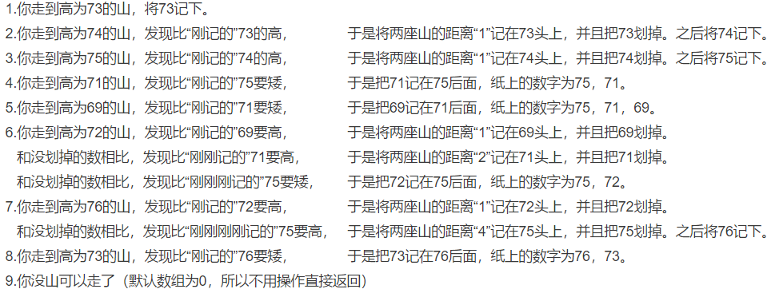
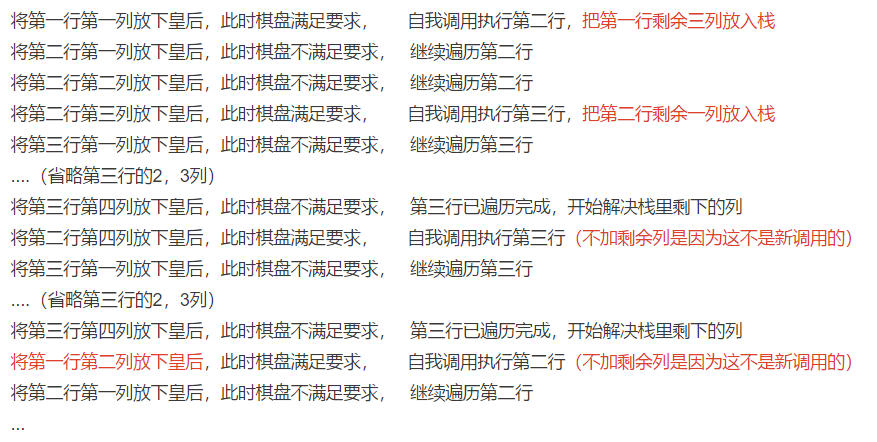
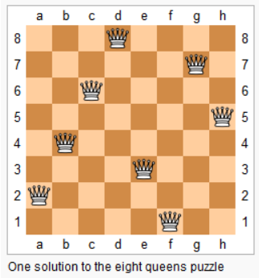

用两道题来了解一下栈

[150. 逆波兰表达式求值](https://leetcode-cn.com/problems/evaluate-reverse-polish-notation/)

> 有效的运算符包括 `+`, `-`, `*`, `/` 。每个运算对象可以是整数，也可以是另一个逆波兰表达式。

```java
输入: ["2", "1", "+", "3", "*"]
输出: 9
解释: 该算式转化为常见的中缀算术表达式为：((2 + 1) * 3) = 9
```

这道题乍一看无从下手，但是看到下面的逆波兰表达式，基本上把求解的方法写出来了。

> 逆波兰表达式是一种后缀表达式，所谓后缀就是指算符写在后面。
>
> 平常使用的算式则是一种中缀表达式，如 ( 1 + 2 ) * ( 3 + 4 ) 。
> 该算式的逆波兰表达式写法为 ( ( 1 2 + ) ( 3 4 + ) * ) 。
> 逆波兰表达式主要有以下两个优点：
>
> 去掉括号后表达式无歧义，上式即便写成 1 2 + 3 4 + * 也可以依据次序计算出正确结果。
> 适合用栈操作运算：遇到数字则入栈；遇到算符则取出栈顶两个数字进行计算，并将结果压入栈中。

只需要注意除法和乘法，两个数字之间的顺序即可，这道题就能解了。

[739. 每日温度](https://leetcode-cn.com/problems/daily-temperatures/)

> 请根据每日 气温 列表，重新生成一个列表。对应位置的输出为：要想观测到更高的气温，至少需要等待的天数。如果气温在这之后都不会升高，请在该位置用 0 来代替。
>
> 例如，给定一个列表 temperatures = [73, 74, 75, 71, 69, 72, 76, 73]，你的输出应该是 [1, 1, 4, 2, 1, 1, 0, 0]。

直接两层for循环暴力破解，但显然这达不到时间复杂度的要求，而题目提示了你可以用栈来解决。

你可以查看这个[题解](https://leetcode-cn.com/problems/daily-temperatures/solution/leetcode-tu-jie-739mei-ri-wen-du-by-misterbooo/)的动画帮助理解

想象一下，将表示温度的数字转变成“表示一座山的高度”，其余不变。

以题目为例[^1]



“记下”和“划掉”对应的是栈的**压入和弹出**，之所以要用那么多“刚”，是为了体现“两座山的距离”，即**下标差**，以及突出栈“先入后出”的特点。

为什么每次都只需要**“与记在纸上最近的山比高”**，就可以做到和**“与之前所有的山比高”**一样效果呢

因为利用了栈先入后出的特点，不断“记下”“划掉”**维护着栈的单调性**，以至于“留在纸上最近的山”便是“将军里拔出来的矮子”

这其实与滑动窗口有着异曲同工之妙

滑动窗口是在根据规则维护着**队列**

而这些题是在根据规则维护着**栈**

他们都在**维护的过程中更新答案**

又或许他们本来就是“一家子”，滑动窗口的题目大都可以用队列辅助解决。但这又多此一举，用指针借助数组本身就可以作为“队列”，不用浪费多余的空间。


##### 什么是深度优先搜索（DFS）？

> 如何知道通过一个迷宫的最短路径是哪条路？

​       以深度优先搜索的办法来举例：你只有一个人，不会分身，只能在岔口标记自己来过这条路。若是这个迷宫的每个岔路都只有两个路口，那么你走到底的第一条路径就是“左左左左左左...左左”，第二条路径就是“左左左左左左...左右”，第三条路径就是“左左左左左左...右左”以此类推。

> 不断往下走，错了就回头。

当你把所有路径都走一遍之后，自然就知道最短路径是哪条路了。

再回想一下递归篇，是否觉得很熟悉呢。


那种最简单，不做优化的斐波那契数列，便是深搜最基本的形态。

[面试题 16.19. 水域大小](https://leetcode-cn.com/problems/pond-sizes-lcci/)

> 你有一个用于表示一片土地的整数矩阵land，该矩阵中每个点的值代表对应地点的海拔高度。若值为0则表示水域。由垂直、水平或对角连接的水域为池塘。池塘的大小是指相连接的水域的个数。编写一个方法来计算矩阵中所有池塘的大小，返回值需要从小到大排序。

```java
输入：
[
  [0,2,1,0],
  [0,1,0,1],
  [1,1,0,1],
  [0,1,0,1]
]
输出： [1,2,4]
```

思路比较简单，只要遍历这个二维数组，碰到0就开始用dfs将0周围的数字改为1（即土地），这样下次就不会遍历到了，同时用变量记录大小。

这道题说垂直水平和对角都算连接的水域，意味着一个点**有机会**延伸到周围的八个点。所以dfs的写法就是类似“给我一个是0的坐标，我把他变成1，之后再调用8个自己（递归），每个自己传不同方向坐标（传参）”，然后这8个自己**每个又能调用自己**。在调用自己的同时，将其他未处理的问题（7个同级的自己）**以栈的形式保存**。等到将第一个分支（8个分支的第1个分支）解决完成，就把栈拿出来继续解决第二个分支（8个分支的第2个分支）

除此之外，还有些附加的小问题。需要**考虑边界**，例如四个边只有5个选择，四个角只有3个选择，还有题目最后要求**答案排序**。[^2]

[51. N 皇后](https://leetcode-cn.com/problems/n-queens/)

> n 皇后问题 研究的是如何将 n 个皇后放置在 n×n 的棋盘上，并且使皇后彼此之间不能相互攻击。
>
> 给你一个整数 n ，返回所有不同的 n 皇后问题 的解决方案。
>
> 每一种解法包含一个不同的 n 皇后问题 的棋子放置方案，该方案中 'Q' 和 '.' 分别代表了皇后和空位。


```java
输入：n = 4
输出：[[".Q..","...Q","Q...","..Q."],["..Q.","Q...","...Q",".Q.."]]
解释：如上图所示，4 皇后问题存在两个不同的解法。
```

你的目的是为了拿到皇后可以摆放的所有棋盘，那么只要遍历所有棋子可能摆放的位置就可以得出。

##### 问题是怎么遍历?

以行为单位，以列为分支（反过来也行）

- 你在第一行的第一列写下Q，意味着你已**做出了第一行的选择**，而“第一行剩下的选择”被保存在栈里。[^3]

- 你在第二行的第一列写下Q，意味着你已**做出了第二行的选择**，而“第二行剩下的选择”被保存在栈里。

  。。。

- 你在第n行的第一列写下Q，意味着你已**做出了第n行的选择**，这时是最后一行...当你把第n层都遍历之后，就**“回退到n-1行”**（解决放在栈里的问题）。

- 于是在n-1行的第二列写下Q后，继续遍历第n行...

以n=3为例，遍历整个棋盘就相当于遍历一棵“三叉树”

你在第一行第一列写下Q，就是在**选择第一层的第一个分支。**

以此类推，整个棋盘的遍历次数就是最后一层“叶子结点”的个数27，当n=8时数字就扩大到16777216。显然，这样不加筛选的遍历太笨了，你完全可以在“发现错误时”直接把接下来的分支拦腰斩断，俗称**“剪枝”**。例如你已在第一行第一列写下Q，那么第二行的1，2列就不应该继续“向下展开”了。

你可以写一个函数，输入是$（“当前棋盘（二维数组）”，“选择行”，“选择列”）$，通过三个for循环$（判断列，判断左斜，判断右斜）$，返回是$“是否可以将皇后下在这”$。若是可以，则选择该分支；若是不行，则将其跳过。

如果这样判断的话就会出现一个问题——因为我的判断依据是**当前棋盘**，而我**之前的选择**（写Q）还留在棋盘上啊。

所以，我要在其解决完展开的问题之后，将其**抹去**（写“.”），让他不影响到同级的选择——这就是**回溯**

> 打个比方，你花钱（写Q）雇人（节点）做任务（探索分支），等他把任务做完后再杀了他（写.），然后把钱抢回来雇下个人

回溯之所以叫回溯，是因为它能够**“回到初始状态”**，使得你接下来操作不受之前的影响

但是也仅此而已

他和“写Q”是一个东西，只不过顺序不同。一个是在**“展开”前**，一个是在**“展开并解决”后**，不需要单独拎出来理解——又或是它只有在“深搜”这一大前提下，才有意义。后续会提到，这本质上是**树的前序与后续遍历**。

重新梳理一遍：

1. 将所有情况遍历可解此题（按层分支的递归）
2. 通过剪枝，放弃计算“必然会错”的分支，减少计算
3. 为了不影响剪枝，需要用回溯回归初始状态

以下展示了n=4部分步骤，希望你可以理解第二点[^4]：



除此之外，还有一种解法，可以巧妙的避开回溯

将“当前棋盘”的二维数组降维到一维数组，即原先在**二维数组上直接存储“Q”，“.”**，改成**一维数组按下标存储对应行的棋子摆放位置**



对应数组[3，6，2，7，1，4，0，5]（下标从0开始）

而剪枝所需要的参数**横纵坐标**，变成了对应的**数组下标**与**下标对应的值**。

这样在剪枝的过程中不需要遍历所有的棋子，就能找到**以前下的“Q”**——或是**能更加精确**的找到棋子，避免了无意义的搜索。而每次落子都会**直接覆盖掉当前行的选择**，从而不需要回溯。

你也可以理解为

“踩在他们的尸体上”


[^1]: 程序本身是最简洁的“语言”，之所以那么啰嗦是因为担心讲不清楚（又或许越讲越乱）。亦是大家可能刚开始学，对程序“语言”不太了解，这里先充当一次不合格的“翻译”。
[^2]: “对于新手来说数组边界是很头疼的问题，所以需要不断尝试做题，做不出来看看解题区（摊手.jpg）
[^3]: 剩下的选择”：例如n=4，剩下的选择为2，3，4。这些选择并不是一个一个压入栈的，否则出来的顺序就会变成“4，3，2”。而“保存在栈里”的操作更像是把2，3，4“打包”成一个“块”，是这个块被压入了栈。而这个块被弹出调用时，内部的顺序没有打乱。
[^4]: “不加剩余列是因为这不是新调用的”你也可以理解为它“还在解决问题”，关于第三行或第一行（标红）提出的问题还未解决完。

以上题目与部分图片均转载自[leetcode](https://leetcode-cn.com/)