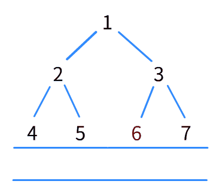
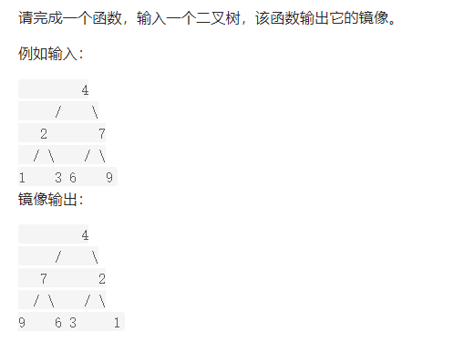

##### 什么是树？

“树”其实是一个很形象的比喻



你把这个用来描述BFS的图倒过来看，就会发现这些数字之间的路径和数字本身组成了一颗“树”。

以图中的二叉树为例：

- 1是“根节点”

- 2是1“左子节点”，3是1的“右子节点”

- 以2为首的2，4，5是1的“左子树”，反之3，6，7是1的“右子树”

  

##### 什么是“X序遍历”

对于树而言，有四种遍历：

- 前序遍历
- 中序遍历
- 后序遍历
- 层序遍历

层序遍历就是广度优先搜索，而其他遍历一般都有三种解法：递归，迭代，Morris

这篇仅用递归解法来解释“X序遍历”是什么

```
public void traversal(Node 节点) {
	traversal(节点的左节点)
	traversal(节点的右节点)
}
```

对于用递归的遍历来说：这“两行代码”就能遍历一颗二叉树。

你完全可以想象它的操作——不断用“traversal（节点的左节点）”，将“traversal	(节点的右节点)”压入栈。等到解决了问题（遍历到叶子结点，即没有子节点），就把栈里的问题一一弹出解决。


##### 对于“X序遍历”而言：

- 若你想**前序遍历**，即按照**“根左右”**的顺序，在这两行递归**前**插入操作——也就是在**“拿到节点”的那一刻动手**，那就是前序遍历。
- 若你想**中序遍历**，即按照**“左根右”**的顺序，在这两行递归**中**插入操作——也就是在**“解决完左子树”的那一刻动手**，那就是中序遍历。
- 若你想**后序遍历**，即按照**“左右根”**的顺序，在这两行递归**后**插入操作——也就是在**“解决完左，右子树”的那一刻动手**，那就是后序遍历。

递归遍历树**本身就包含了“前中后”序遍历**，只不过“没有写出来”罢了

你要是想，完全可以整个“前中”，“中后”，“前中后”序遍历[^1]

例如：深度优先搜索以“树”的概念来看，它是一种**“前序”遍历**，而其包含的回溯则是一种**“后序”遍历**，所以n皇后那题的思路可以称作“前后序遍历”。


用两道题目感受一下“X序遍历”

[剑指 Offer 27. 二叉树的镜像](https://leetcode-cn.com/problems/er-cha-shu-de-jing-xiang-lcof/)

> 

若是用**前序遍历**

1. 拿到“4”的那一刻动手，将“以2为首的左子树”和“以7为首的右子树”交换。

   再把7（现在7是左节点）作为参数放入递归，同时把2压入栈中。

2. 拿到“7”的那一刻动手，将69叶子节点互换[^2]

3. 把栈里的“2”弹出来动手，将31叶子节点互换

若是用**后序遍历**

1. 拿到“4”不动，把2作为参数放入递归，同时把4，7压入栈中[^3]
2. 拿到“2”不动，把1作为参数放入递归，同时把3，2压入栈中
3. 1为叶子节点不动，把栈弹出的3拿出来，同样为叶子节点，不动
4. 把栈里的2弹出，将2的左右节点对换，即1，3换位
5. 把栈里的7弹出，将7的左右节点对换，即6，9换位
6. 把栈里的4弹出，将4的左右节点对换，即2，7换位（左右子树互换）

前序遍历**从树的根部开始调换**

后序遍历**从叶子节点开始调换**

中序遍历呢？不太行，因为它的顺序是先解决左子树，再解决自己，最后解决右子树。

若是这道题用了，就变成了：

> “我好不容易把2这颗子树里的数字对调好位置，结果你又把2和7对调，让我再对2操作一遍，把2给还原了”

虽然对这道题来说中序遍历是鸡肋，但是它有它独特（常用）的用法。


[230. 二叉搜索树中第K小的元素](https://leetcode-cn.com/problems/kth-smallest-element-in-a-bst/)

> 给定一个二叉搜索树，编写一个函数 `kthSmallest` 来查找其中第 **k** 个最小的元素。

```java
输入: root = [3,1,4,null,2], k = 1
   3
  / \
 1   4
  \
   2
输出: 1
```

由于二叉搜索树的特殊性质[^4]，使得中序遍历的操作（左根右）能够按照数值的单调顺序遍历。

以题目为例，用中序遍历，那么对应的操作对象顺序为：1，2，3。那么只要**在操作的时候记录次数**，到达相应次数输出元素即可。


[^1]: 此处可能有歧义，我想表达的意思是——在遍历过程中所能做的操作，而非新的遍历方式。
[^2]: 6，9因为是叶子节点，左右节点为空不做操作，故省略描述。3，1同理
[^3]: 为什么前序遍历在拿到4的时候不把4压入栈中？你可以理解为前序遍历已经对4操作过了，所以不需要操作——或是有压入栈中但是没做操作。
[^4]: 二叉搜索树，Binary Search Tree，简称BST。每个节点与左右节点的大小排列是：左节点<节点<右节点，可以参考题目第k小的元素例子。

以上题目与部分图片均转载自[leetcode](https://leetcode-cn.com/)